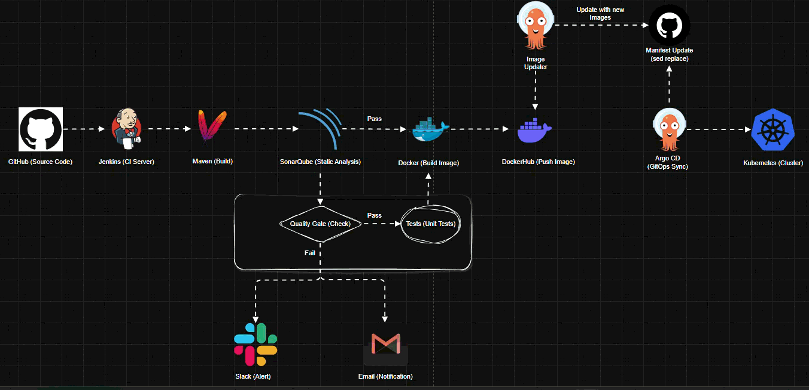
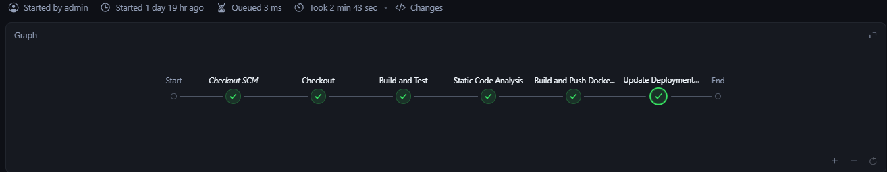
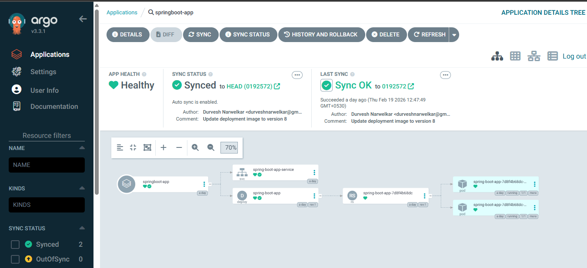
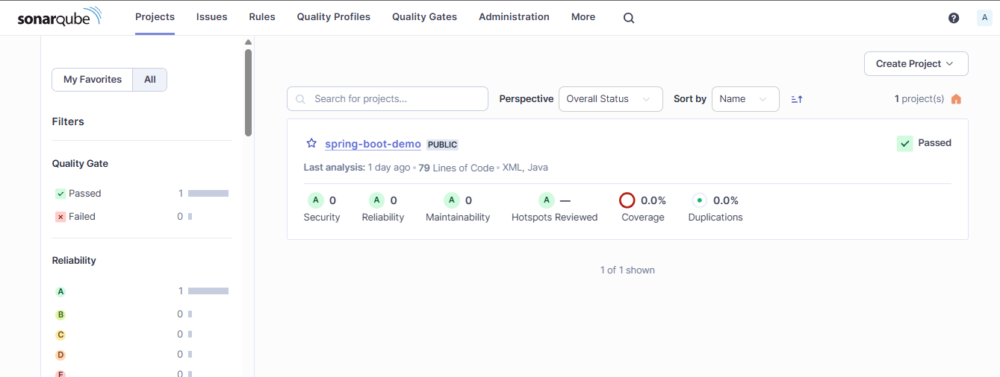

# 🚀 Enterprise GitOps-Driven CI/CD Platform

> An end-to-end, production-grade CI/CD platform implementing GitOps principles using Jenkins, SonarQube, Docker, Argo CD, and Kubernetes.

---
# 📌 Project Overview

This project demonstrates a complete **enterprise-grade CI/CD pipeline integrated with GitOps principles**, automating the entire software delivery lifecycle --- from code commit to Kubernetes deployment.
The platform is designed to follow modern DevOps best practices, ensuring: 
- Reliability
- Quality Enforcement
- Traceability
- Automated Infrastructure Reconciliation.

## 🚀 Key Capabilities

- **Automated Build & Testing**: Ensures every code commit is validated through structured pipeline stages.
- **Static Code Analysis with Quality Gates**: Enforces code quality, security, and maintainability standards before deployment.
- **Containerization**: Packages the application into immutable Docker images for consistent runtime behavior.
- **Image Registry Management**: Automatically builds and pushes versioned images to DockerHub.
- **Git-Based Deployment Automation (GitOps)**: Updates Kubernetes manifests in a Git repository to trigger deployments declaratively.
- **Kubernetes Reconciliation via Argo CD**: Continuously monitors the desired state in Git and syncs the cluster automatically.

---

# 🏗 Architecture Overview

---
# 🔄 End-to-End Workflow
## 1️⃣ Code Commit

Developer pushes code to GitHub. Jenkins triggers automatically via webhook or SCM polling.

## 2️⃣ CI Pipeline Execution (Jenkins)

-   Checkout source code
-   Build application using Maven
-   Run unit tests
-   Perform static code analysis via SonarQube
-   Validate Quality Gate
-   Build Docker image
-   Push image to DockerHub
-   Update Kubernetes manifest with new image tag

## 3️⃣ GitOps Deployment via Argo CD

-   Argo CD monitors Git repository
-   Detects manifest changes
-   Automatically syncs application to Kubernetes cluster
-   Ensures desired state reconciliation

---

# 🔐 Quality Gate Enforcement

Deployment proceeds only if:

- No critical vulnerabilities  
- No blocker bugs  
- Maintainability standards are met  

If Quality Gate fails → **Pipeline stops immediately.**

---
## 🛠 Tech Stack

- CI/CD: Jenkins  
- Code Quality: SonarQube  
- Containerization: Docker  
- Registry: DockerHub  
- Orchestration: Kubernetes  
- GitOps Controller: Argo CD  
- Build Tool: Maven  
- Application: Spring Boot

---

# 🚀 GitOps Principles Implemented

-   Declarative Infrastructure
-   Git as Single Source of Truth
-   Pull-Based Deployment Model
-   Automated State Reconciliation
-   Immutable Docker Image Versioning

---

# 🎯 What This Project Demonstrates

-   Enterprise-level CI/CD pipeline design
-   GitOps-based Kubernetes deployment
-   DevOps automation engineering
-   Production-style quality enforcement
-   Infrastructure as Code best practices

---
## 📄 License

This project is licensed under the [MIT License](LICENSE).
